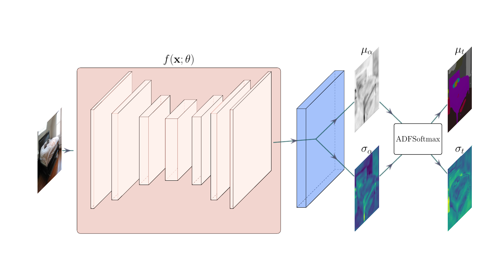

# Embedded Uncertainty for Semantic Segmentation

This repo contains code for the paper: Uncertainty in Real-Time Semantic Segmentation on Embedded Systems 

[arXiv Link to paper](https://arxiv.org/abs/2301.01201). 

## Corrections made in arXiv version
If you came from the CVPR version of the paper, would recommend referring to the arXiv version as I found an error that I have since corrected. Specifically, I didn't square some of some standard deviations, (particularly in Eqn. 15.), so that what I was referring to as a variance was actually a standard deviation. Is one of those typos/mistakes that doesn't change any of the results, methods, or conclusions, but is still an error and would like to make the best efforts to correct it. Unfortunately, [IEEE don't allow for corrections or corrigendum](https://statmodeling.stat.columbia.edu/2020/12/10/ieees-refusal-to-issue-corrections/). Regardless have corrected the arXiv version, and tidied the notation to make more clear, so I would recommend citing that version as well, but I sincerely apologies for the inconvenience (citation info at end of this README). 


## Description

This work expands upon the BiSeNet models for real-time semantic segmentation to include a probabilistic classifier block that allows for single pass uncertainty estimates. This has been demonstrated to permit real-time semantic segmentation on Jetson embedded GPU devices from NVIDA.




This code is based of the implementation of BiSeNet by [CoinCheung](https://github.com/CoinCheung/BiSeNet), which includes instructions for compilation to using TensorRT. This code has also been modified to permit the use of the proposed probabilistic segmentation module. Instructions for TensorRT compilation can be found  [here](./tensorrt). 

## Training

Training builds upon the pre-existing weights from [here](https://github.com/CoinCheung/BiSeNet). Links to the pre-trained models are as follows,

### Cityscapes
bisenetv1 [download](https://github.com/CoinCheung/BiSeNet/releases/download/0.0.0/model_final_v1_city_new.pth)
bisenetv2  [download](https://github.com/CoinCheung/BiSeNet/releases/download/0.0.0/model_final_v2_city.pth) |

### CocoStuffs
bisenetv1 [download](https://github.com/CoinCheung/BiSeNet/releases/download/0.0.0/model_final_v1_coco_new.pth) 
bisenetv2  [download](https://github.com/CoinCheung/BiSeNet/releases/download/0.0.0/model_final_v2_coco.pth) 

### ADE20k
bisenetv1 [download](https://github.com/CoinCheung/BiSeNet/releases/download/0.0.0/model_final_v1_ade20k.pth)
bisenetv2 [download](https://github.com/CoinCheung/BiSeNet/releases/download/0.0.0/model_final_v2_ade20k.pth)


### Running training for embedded uncertainty

Training is done using the pytorch [Torchrun](https://pytorch.org/docs/stable/elastic/run.html) to allow for distributed training when available. To perform fine tuning to allow addition, you can run the [tools/train_amp.py](./tools/train_amp.py) script.

An example
``` shell
torchrun  --nnodes=1 --nproc_per_node=1 --rdzv_id=100 --rdzv_backend=c10d --rdzv_endpoint=$MASTER_ADDR:29400  tools/train_amp.py --config ./configs/bayes_bisenetv2_city.py --finetune-from ./models/model_final_v2_city.pth
```

Where `bayes_bisenetv2_city.py` is a configuration dictionary with training info, and `./models/model_final_v2_city.pth` is a reference to the pretrained model downloaded as described above. Descriptions for preparing datsets can be found below.


## Evaluation 

For evaluation, the [./tools/evaluate.py](./tools/evaluate.py) script is used. An example is provided as,

``` shell
python tools/evaluate.py --weight-path ./res/bisenetv2_CocoStuff_bayes_model_final.pth --config ./configs/bayes_bisenetv2_coco.py --mode eval_bayes_prob
```

The `--mode` argument instructs how the model will operate. If `--mode eval_bayes_prob`, the chosen model will be evaluated using the proposed probabilistic module. If `--mode eval`, it will be evaluated as a normal point-estimate network and will not output uncertainty information.

## Uncertainty Visualisation 


For visualisation, the [./tools/demo.py](./tools/demo.py) script is used. An example is provided as,

``` shell
python tools/demo.py --config ./configs/bisenetv2_city.py --weight-path ./res/model_final.pth  --img-path /home/ethan/exp_data/cityscapes/leftImg8bit/train/cologne/cologne_000000_000019_leftImg8bit.png 
```


## prepare dataset

These instructions are laregely the same as from  [CoinCheung](https://github.com/CoinCheung/BiSeNet), but are listed here for completeness.
1.cityscapes  

Register and download the dataset from the official [website](https://www.cityscapes-dataset.com/). Then decompress them into the `datasets/cityscapes` directory:  
```
$ mv /path/to/leftImg8bit_trainvaltest.zip datasets/cityscapes
$ mv /path/to/gtFine_trainvaltest.zip datasets/cityscapes
$ cd datasets/cityscapes
$ unzip leftImg8bit_trainvaltest.zip
$ unzip gtFine_trainvaltest.zip
```

2.cocostuff   

Download `train2017.zip`, `val2017.zip` and `stuffthingmaps_trainval2017.zip` split from official [website](https://cocodataset.org/#download). Then do as following:  
```
$ unzip train2017.zip
$ unzip val2017.zip
$ mv train2017/ /path/to/BiSeNet/datasets/coco/images
$ mv val2017/ /path/to/BiSeNet/datasets/coco/images

$ unzip stuffthingmaps_trainval2017.zip
$ mv train2017/ /path/to/BiSeNet/datasets/coco/labels
$ mv val2017/ /path/to/BiSeNet/datasets/coco/labels

$ cd /path/to/BiSeNet
$ python tools/gen_dataset_annos.py --dataset coco
```

3.ade20k

Download `ADEChallengeData2016.zip` from this [website](http://sceneparsing.csail.mit.edu/) and unzip it. Then we can move the uncompressed folders to `datasets/ade20k`, and generate the txt files with the script I prepared for you:  
```
$ unzip ADEChallengeData2016.zip
$ mv ADEChallengeData2016/images /path/to/BiSeNet/datasets/ade20k/
$ mv ADEChallengeData2016/annotations /path/to/BiSeNet/datasets/ade20k/
$ python tools/gen_dataset_annos.py --ade20k
```


4.custom dataset  

If you want to train on your own dataset, you should generate annotation files first with the format like this: 
```
munster_000002_000019_leftImg8bit.png,munster_000002_000019_gtFine_labelIds.png
frankfurt_000001_079206_leftImg8bit.png,frankfurt_000001_079206_gtFine_labelIds.png
...
```
Each line is a pair of training sample and ground truth image path, which are separated by a single comma `,`.   

I recommand you to check the information of your dataset with the script:  
```
$ python tools/check_dataset_info.py --im_root /path/to/your/data_root --im_anns /path/to/your/anno_file
```
This will print some of the information of your dataset.  

Then you need to change the field of `im_root` and `train/val_im_anns` in the config file. I prepared a demo config file for you named [`bisenet_customer.py`](./configs/bisenet_customer.py). You can start from this conig file.

## Compilation with TensorRT
Instructions for compilation with TensorRT can be found [here](./tensorrt/README.md)

## Questions?
Feel free to email me (Ethan) at ej.goan@qut.edu.au

## Citation

``` 
@article{goan2023uncertainty,
  title={Uncertainty in Real-Time Semantic Segmentation on Embedded Systems},
  author={Goan, Ethan and Fookes, Clinton},
  journal={arXiv preprint arXiv:2301.01201},
  year={2023}
}
```
